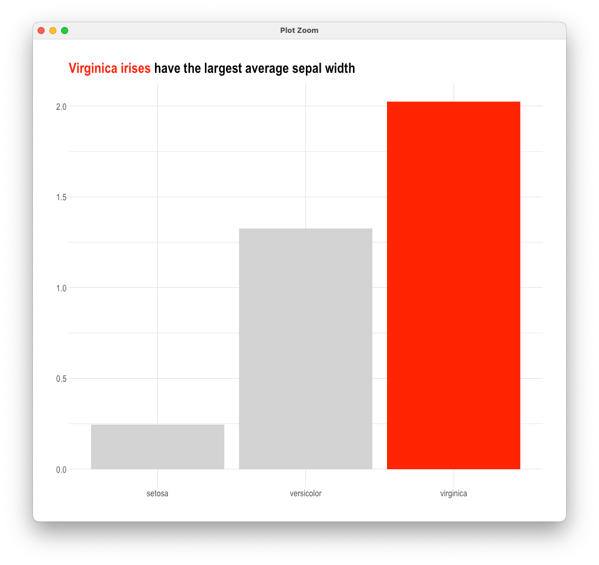
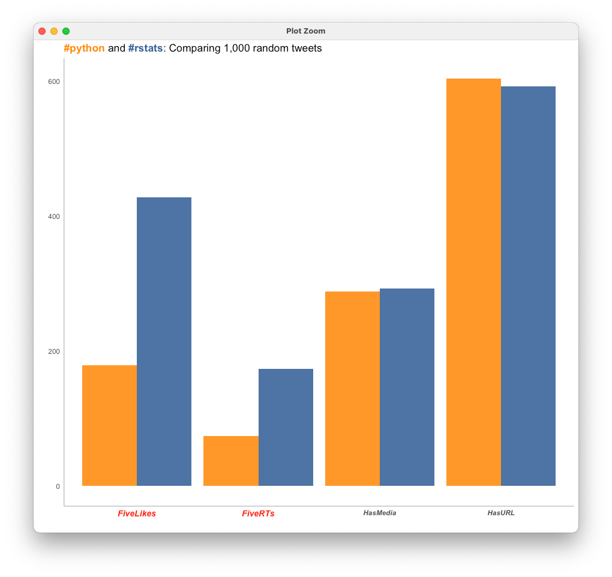

# ggtext demo

**Demo — rich text in ggplot2 (markdown in titles and axis labels).**

Not a case study. Two small R recipes for `element_markdown()`: colour highlights, bold spans, styled axis text.

---

## What it shows

| Script | Idea | Preview |
|--------|------|---------|
| `01-highlighted-title.R` | Colour a phrase in the plot title |  |
| `02-styled-labels.R` | Progressive title/axis styling with HTML spans |  |

```r
labs(title = "<span style='color: red;'>Virginica irises</span> have the largest average sepal width") +
  theme(plot.title = element_markdown())
```

## When to use it

- Polished charts for decks and blogs  
- Teaching ggplot theming beyond `element_text()`  

## Run it

```r
install.packages(c("ggplot2", "ggtext", "dplyr", "glue", "hrbrthemes"))
source("01-highlighted-title.R")
source("02-styled-labels.R")
```

**Stack:** `ggplot2` · `ggtext` · `glue`

---

*Demo companion — [datafying](https://datafying.co/).*
